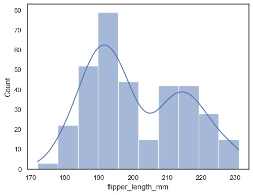

# Estatística com python: frequências e medidas

## Introdução

 Anotações feitas durante o curso de análise estatística utilizando linguagem python. Tópicos abordados:

- [Tipos de dados](./curso-1.md#tipos-de-dados)
- [Distribuição de frequências](./curso-1.md#distribuição-de-frequências)
  - [Variáveis qualitativas](./curso-1.md#variáveis-qualitativas)
    - [Cruzamento de variáveis](./curso-1.md#cruzamento-de-variáveis)
  - [Variáveis quantitativas](./curso-1.md#variáveis-quantitativas)
  - [Histogramas](./curso-1.md#histogramas)
- [Medidas de tendência central](./curso-1.md#medidas-de-tendência-central)
  - [Média](./curso-1.md#media)
  - [Mediana](./curso-1.md#mediana)
  - [Moda](./curso-1.md#moda)
  - [Relação entre média mediana e moda](./curso-1.md#relação-entre-média-mediana-e-moda)
- [Medidas separatrizes](./curso-1.md#medidas-separatrizes)
  - [Quartis, decis e percentis](./curso-1.md#quartis-decis-e-percentis)
  - [Quartis e Boxplot](./curso-1.md#quartis-e-boxplot)
- [Medidas de dispersão](./curso-1.md#medidas-de-dispersão)
  - [Desvio médio absoluto](./curso-1.md#desvio-médio-absoluto)
  - [Variância](./curso-1.md#variância)
  - [Desvio padrão](./curso-1.md#desvio-padrão)

## Tipos de dados

- Dados qualitativos: qualidades, atributos, classificações
  - Ordinais: podem ser ordenados ou hierarquizados (exemplo: anos de estudo)
  - Nominais: não podem ser ordenados ou hierarquizados (exemplo: sexo)
- Dados quantitativos: valores, contagens
  - Discretos: valores possíveis são finitos (exemplo: idade em anos)
  - Contínuos: pode ser qualquer valor real (exemplo: altura)

## Distribuição de frequências

Trata-se da análise estatística da frequência com que uma variável qualitativa possuí cada um de seus valores ou uma variável quantitativa está dentro de intervalos determinados.

### Variáveis qualitativas

A distribuição de frequências de uma variável qualitativa é basicamente uma contagem de quantos elementos há em cada uma das classes dessa variável. Ao trabalhar com a biblioteca pandas, isso pode ser feito utilizando a função `value_counts()`. Por exemplo, caso a variável df seja um dataframe pandas com uma coluna de sexo, o código abaixo gerará uma tabela similar a tabela abaixo contendo a distribuição de frequências desta variável.

```python
quantidades = df.sexo.value_counts()
percentuais = df.sex.value_counts(normalize=True) * 100
df_frequencias = pd.DataFrame({'Frequência': quantidades, 'Porcentagem': percentuais})
df_frequencias.rename(index={0: 'Masculino', 1: 'Feminino'}, inplace=True)
df_frequencias.rename_axis('Sexo', axis='columns', inplace=True)
```

|    Sexo   |    Frequência | Porcentagem |
|:---------:|:-------------:|:-----------:|
| Masculino |     53250     |    69,3%    |
|  Feminino |     23590     |    30,7%    |

#### Cruzamento de variáveis

É possível também realizar o cruzamento de variáveis de forma a construir esta tabela analisando mais de uma variável por vez. Para isso, em python, utilizamos a função `pd.crosstab()`, se necessário consulte a [documentação](https://pandas.pydata.org/docs/reference/api/pandas.crosstab.html). O exemplo de código abaixo mostra a análise das variáveis sexo e cor.

```python
frequencia = pd.crosstab(
    dados.sexo,
    dados.cor,
)
frequencia.rename(index={0: 'Masculino', 1: 'Feminino'}, inplace=True)
frequencia.rename(columns={
    0: 'Indígena',
    2: 'Branca',
    4: 'Preta',
    6: 'Amarela',
    8: 'Parda',
    9: 'Sem classificação',
})
```

|    Cor    | Indígena | Branca | Preta | Amarela | Parda |
|:---------:|:--------:|:------:|:-----:|:-------:|:-----:|
|    Sexo   |          |        |       |         |       |
| Masculino |    256   |  22194 |  5502 |   235   | 25063 |
|  Feminino |    101   |  9621  |  2889 |   117   | 10862 |

### Variáveis quantitativas

Variáveis quantitativas não são, por sua natureza, dividida em classes, desta forma, antes de verificar a distribuição de frequências é necessário separá-las em diversas classes. Essa separação pode ser arbitrária ou pode depender do problema a ser tratado. Por exemplo, se a variável for o salário de um grupo de pessoas, podemos dividir essas pessoas pela classe social. O código em python abaixo faz essa divisão e calcula a distribuição de frequências de uma variável de salário, o resultado é um dataframe similar ao que pode ser visto abaixo do código.

Esse código faz uso da função `pd.cut()` que faz a classificação desde que você passe os limites ou o número de intervalos desejados. Para saber mais de uma olhada na [documentação da função](https://pandas.pydata.org/docs/reference/api/pandas.cut.html)

```python
salario_minimo = 788
classes = [salario_minimo * limite for limite in [0, 2, 4, 10, 20]]
classes.append(df.salario.max())
labels = ['E', 'D', 'C', 'B', 'A']
intervalos = pd.cut(
    x=dados.salario,
    bins=classes,
    labels=labels,
    include_lowest=True,
)
frequencias = pd.value_counts(intervalos)
percentuais = pd.value_counts(intervalos, normalize=True) * 100
df_frequencias = pd.DataFrame({'Frequência': quantidades, 'Porcentagem': percentuais})
df_frequencias.sort_index(ascending=True)
```

| Salário |    Frequência | Porcentagem |
|:-------:|:-------------:|:-----------:|
|    A    |     608       |     0,79%   |
|    B    |     2178      |     2,83%   |
|    C    |     7599      |     9,88%   |
|    D    |     16700     |    21,73%   |
|    E    |     49755     |    64,75%   |

### Histogramas

Histogramas são representações gráficas de uma tabela de frequências. Trata-se de um gráfico formado por barras lado a lado em que a área de cada barra é proporcional à frequência da classe representada. Uma forma simples de plotar um histograma em python é utilizando a função `sns.histplot()` do módulo seaborn, a sua documentação está disponível [neste link](https://seaborn.pydata.org/generated/seaborn.histplot.html#seaborn.histplot). Um exemplo de histograma encontrado nesta mesma documentação pode ser visto abaixo.

```python
import seaborn as sns
pinguins = sns.load_dataset("penguins")
sns.histplot(data=pinguins, x="flipper_length_mm", kde=True)
```



## Medidas de tendência central

### Média

A média é o centro de massa da distribuição de uma variável, ela é representada por \\( \mu \\) quando se refere à uma população e por \\( \overline{X} \\) quando se trata de uma amostra da população. Por ser o centro de massa, nem sempre essa medida é uma boa representação da variável por completo, principalmente em variáveis muito desbalanceadas, ainda assim é muito utilizada. Ela pode ser calculada utilizando a função `df.mean()` que realiza o calculo da fórmula abaixo.

\\[ \mu = \frac{1}{n} \sum_{i=0}^n X_i \\]

### Mediana

A mediana é o valor que divide a variável exatamente ao meio, assim, por exemplo, caso a mediana de uma variável \\( X \\) com 101 observações seja 5 isso significa que dessas observações uma possuí o valor 5, 50 possuem um valor __menor__ do que 5 e 50 possuem um valor __maior__ do que 5. Ela pode ser calculada pela função `df.median()` ou df.quantile()` que aplica o passo a passo a seguir:

1. Identificar o número de amostras `n`;
2. Ordenar a variável;
3. Identificar o elemento mediano
   - Caso `n` seja ímpar: \\( el_{mediano} = \dfrac{n+1}{2} \\)
   - Caso `n` seja par: \\( el_{mediano} = \dfrac{n}{2} \\)
4. Obter a mediana:
   - Caso `n` seja ímpar: \\( mediana = X[el_{mediano}] \\)
   - Caso `n` seja par: \\( mediana = \dfrac{X[el_{mediano}] + X[el_{mediano} + 1]}{2} \\)

### Moda

A moda de uma variável é basicamente o elemento que aparece mais vezes. Normalmente ela é calculada ou para variáveis categóricas (qualitativas) ou para variáveis quantitativas discretas pois como variáveis quantitativas contínuas podem assumir qualquer valor, o uso da moda deixa de fazer tanto sentido. O seu calculo requer apenas uma contagem da quantidade de vezes que cada elemento aparece na variável, assim a função `pd.value_counts()` serve para calcula-la já que essa função faz a contagem de todos os elementos, mas também pode ser obtida pela função `pd.mode()`.

### Relação entre média mediana e moda

A partir desses três valores é possível verificar a simetria da variável, os três casos mais comuns podem ser vistos na figura abaixo.

![Três gráficos de função densidade de probabilidade. O primeiro, mais a esquerda mostra um gráfico com probabilidades mais altas para valores menores e mais baixas para valores menores, além disso ele deixa explicito que a moda < mediana < média, seu título é "Assimetria à direita". O segundo, cujo título é "Simétrica" possuí o formato de uma curva gaussiana padrão e deixa explicito que a média = mediana = moda. O Terceiro, mais à direita tem título "Assimetria à direita" possuí probabilidades menores para valores pequenos e maiores para valores mais altos, ele explicita que média < mediana < moda.](assets/curso-1/simetria.png)

## Medidas separatrizes

### Quartis, decis e percentis

Há diversas medidas que encontram o valor em uma dada posição da variável, tal qual a mediana, a diferença principal é que, diferentemente da mediana, essas medidas não buscam o centro, mas sim outros intervalos. A elas damos os nomes de medidas separatrizes e elas são:

- Quartis: 3 quartis dividem os dados em 4 partes;
- Decis: 9 decis dividem os dados em 10 partes;
- Percentis: 99 percentis dividem os dados em 100 partes

Podemos inclusive relacionar os quartis, decis, percentis e a mediana, por exemplo, o segundo quartil divide os dados na metade, exatamente como o 5 decil, o 50 percentil e a mediana.

### Quartis e Boxplot

O [boxplot](https://en.wikipedia.org/wiki/Box_plot) é um tipo de visualização gráfica de uma variável que utiliza os 3 quartis para descrever os dados. Para construí-lo é necessário encontrar os 3 quartis (25%, 50% e 75%) e em seguida a distância inter-quartil que é a subtração \\( Q_3 - Q_1 \\). A figura abaixo mostra um boxplot e onde cada uma dessas medidas é colocada.

![Figura contendo um boxplot. Descrição da esquerda para a direita: três bolas pretas na horizontal nomeadas outliers, uma barra vertical com uma descrição que diz Q1 - 1,5 vezes distancia inter-quartil, esta barra está ligada à extremidade esquerda de um retângulo dividido ao meio, a extremidade esquerda do retângulo é nomeada Q1, a divisória é nomeada Mediana e a extremidade direita é nomeada Q3, essa extremidade é ligada novamente à um traço vertical com descrição Q3 - 1,5 vezes distância inter-quartil, por fim três outras bolas pretas na horizontal nomeadas outliers novamente.](assets/curso-1/boxplot.png)

## Medidas de dispersão

### Desvio médio absoluto

O desvio médio absoluto é uma medida que simplesmente verifica quão longe da média está cada uma das amostras, e realiza uma média dessas distâncias, isso é descrito na fórmula abaixo. Em python, ele pode ser calculado utilizando a função `pd.mad()`.

\\[ DM = \dfrac{1}{n} \sum_{i=1}^n \| x_i - \\mu \|\\]

### Variância

A variância é uma medida de dispersão que antes de calcular a média dos desvios, eleva eles ao quadrado, isso faz com que desvios maiores fiquem maiores ainda e os menores sejam diminuídos. Em python ela pode ser calculada utilizando a função `pd.var()`. Um detalhe importante é que a fórmula para variância populacional é diferente da fórmula para a variância amostral, nas fórmulas abaixo a primeira é a populacional e a segunda é a amostral, essa diferença ocorre por causa do [fator de correção de bessel](https://acervolima.com/correcao-de-bessel/).

\\[ \\sigma^2 = \dfrac{1}{n} \sum_{i=1}^n ( x_i - \\mu )^2 \\]

\\[ S^2 = \dfrac{1}{n - 1} \sum_{i=1}^n ( x_i - \overline{x} )^2 \\]

### Desvio padrão
A variância possuí a vantagem em relação ao desvio médio absoluto de ser mais severa com desvios maiores e menos com desvios menores. Por outro lado, ao elevar os desvios ao quadrado ela modifica a dimensionalidade da variável, sendo assim mais difícil de ser interpretada. Por isso a medida de dispersão mais utilizada é o desvio padrão, que pode ser calculado em python pela função `pd.std()`. O desvio padrão é simplesmente a raiz quadrada da variância e, por causa disso, também possuí duas fórmulas diferentes de ser calculado:

\\[ \\sigma =  \sqrt{\dfrac{1}{n} \sum_{i=1}^n ( x_i - \\mu )^2} = \sqrt{\\sigma^2} \\]

\\[ S =  \sqrt{\dfrac{1}{n - 1}\sum_{i=1}^n ( x_i - \overline{x} )^2} = \sqrt{s^2} \\]