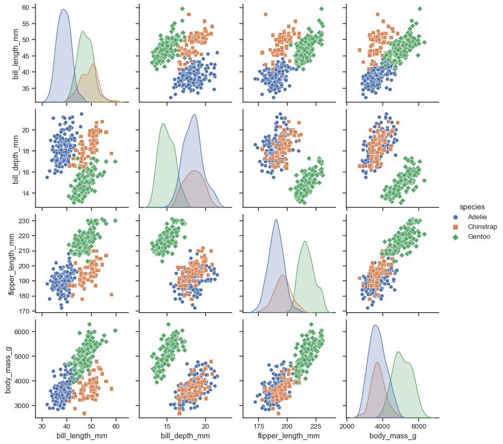
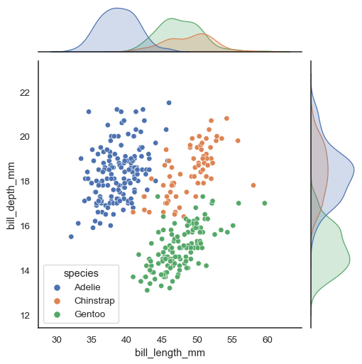

# Regressça linear: testando relações e prevendo resultados

## Introdução

 Anotações feitas durante o primeiro curso de regressão linear. Tópicos abordados:

- [Análises preliminares](./curso-3.md#análises-preliminares)
    - [Matriz de correlações](./curso-3.md#matriz-de-correlações)
- [Comportamento da variável dependente](./curso-3.md#comportamento-da-variável-dependente)
- [Variável dependente Vs variáveis explicativas](./curso-3.md#variável-dependente-vs-variáveis-explicativas)
    - [Pairplot](./curso-3.md#pairplot)
    - [Jointplot](./curso-3.md#jointplot)
- [Datasets de treino e teste](./curso-3.md#datasets-de-treino-e-teste)
    - [Regressão linear](./curso-3.md#regressão-linear)
    - [Métricas](./curso-3.md#métricas)
        - [\\( R^2 \\)](./curso-3.md#r2)
        - [Erro quadrático médio (mean squared error)](./curso-3.md#erro-quadrático-médio-mean-squared-error)
        - [Raíz do erro quadrático médio](./curso-3.md#raíz-do-erro-quadrático-médio-rmse)
    - [Homocedasticidade](./curso-3.md#homocedasticidade)
- [Comparando modelos](./curso-3.md#comparando-modelos)
- [Salvando e carregando o modelo](./curso-3.md#salvando-e-carregando-o-modelo)

## Análises preliminares

### Matriz de correlações

O coeficiente de correlação entre duas variáveis é o nível de similaridade entre o comportamento delas. Esse valor varia de -1 até 1 sendo -1 um comportamento inverso, ou seja, enquanto uma sobe com uma determinada inclinação a outra desce com a mesma proporção, já o valor máximo, 1, indica que ambas crescem ou diminuem na mesma proporção.

Em projetos de data science, principalmente de regressões, é interessante verificar a correlação da variável dependente com as outras variáveis para encontrar as mais explicativas. Além disso, utilizar em um modelo variáveis explicativas com alta correlação não é interessante.

\\[ r = \frac{\sum(x_i - \bar{x})(y_i - \bar{y})}{\sqrt{\sum(x_i - \bar{x})^2(y_i - \bar{y})^2}} \\]

## Comportamento da variável dependente

Foi retrabalhado o conceito de [boxplot](./curso-1.md#quartis-e-boxplot) e [histogramas](./curso-1.md#histogramas)

## Variável dependente Vs variáveis explicativas

### Pairplot

Trata-se de uma forma visual da matriz de correlação. Ele é um grid quadrado contendo na diagonal principal uma visualização da distribuição de frequências de cada uma das variáveis e os outros elementos são relações entre a variável de linha e a de coluna, o tipo de cada um dos gráficos pode variar a depender dos parâmetros fornecidos à função [`sns.pairplot`](https://seaborn.pydata.org/generated/seaborn.pairplot.html). Abaixo há um exemplo de gráfico.

### Jointplot

Este gráfico une duas variáveis um um único gráfico. Assim, na imagem central é mostrado como as variáveis se relacionam e, nas laterais uma distribuição de frequências das variáveis. Novamente, é possível configurar o tipo de cada um dos gráficos através dos parâmetros passados à função [`sns.jointplot`](https://seaborn.pydata.org/generated/seaborn.jointplot.html)

## Datasets de treino e teste

### Regressão linear

Uma regressão é o estudo da dependência de uma variável chamada __dependente__ em relação a uma ou mais variáveis __explicativas__. A ideia com isso é estimar ou prever um valor médio para a variável dependente a partir de um dado conjunto de valores de variáveis explicativas. Um modelo de regressão linear pode ser dividido em:

- Simples: possuí apenas uma variável explicativa;
- Múltipla: possuí mais de uma variável explicativa

A regressão pode ser calculada a partir da fóruma abaixo.

\\[ Y_i = \\beta_0 + \sum_{j=1}^N \left(\\beta_j X_{ji}\right) + u_i \\]

Sendo:

- \\( Y_i \\) o valor calculado para a amostra \\( i \\);
- \\( \\beta_0 \\) o intercepto;
- \\( \\beta_i \\) o coeficiente angular de cada variável explicativa;
- \\( X_{ji} \\) a variável explicativa \\( j \\) da amostra \\( i \\);
- \\( u_i \\) o resíduo, ou erro de regressão da amostra \\( i \\)

### Métricas

#### \\( R^2 \\)

A métrica utilizada para validar uma regressão linear é o coeficiente de determinação: \\( R^2 \\). Ele é uma medida que diz quanto a linha de regressão se ajusta aos dados variando de 0, pior caso, a 1, melhor caso.

\\[ R^2(y, \hat{y}) =  1 - \frac{\sum_{i=0}^{n-1}\left( y_i - \hat{y_i}\right)^2}{\sum_{i=0}^{n-1}\left( y_i - \bar{y_i}\right)^2}\\]

Um grande problema de algoritmos de machine learning é que a adição de muitos parâmetros, inclusive parâmetros pouco explicativos, podem causar o chamado overfit, quando o modelo "decora" os dados de treino melhorando assim o \\( R^2 \\). Para resolver isso foi criado um \\( R^2 \\) ajustado que penaliza a inclusão de parâmetros pouco explicativos:

\\[ \overline{R^2} = 1 - \frac{n - 1}{n - (k + 1)}(1 - R^2) \\]

#### Erro quadrático médio (mean squared error)

Trata-se da média dos quadrados dos resíduos, para calculá-lo, os resíduos são elevados ao quadrado visando remover o sinal, já que como os resíduos seguem, idealmente, uma distribuição normal, sua média seria nula. Assim, ao elevar ao quadrado e remover o sinal o erro deixa de ser nulo.

\\[  EQM(y, \hat{y}) = MSE(y, \hat{y}) = \frac{1}{n} \sum_{i=0}^{n-1} \left( y_i - \hat{y_i}\right)^2\\]

#### Raíz do erro quadrático médio (RMSE)

É basicamente a raíz quadrada do erro quadrático médio, um pouco mais interessante que a métrica anterior pois retorna a variável para a sua dimensão original, facilitando mais a análise.

\\[ REQM(y, \hat{y}) = RMSE(y, \hat{y}) = \sqrt{MSE(y, \hat{y})} = \sqrt{\frac{1}{n} \sum_{i=0}^{n-1} \left( y_i - \hat{y_i}\right)^2}\\]

### Homocedasticidade

Em modelos de regressão é muito importante que os residuos (erros) possuam uma variância constante em relação à variável dependente. Ou seja, conforme a variável dependente aumenta o resíduo deve se manter sempre no mesmo intervalo. A isso damos o nome de homocedasticidade, quando isso não ocorre trata-se de heterocedasticidade.

Um modelo de regressão como homocedasticidade é muito importante pois as métricas e estatísticas formais calculadas em cima de tais modelos só podem ser consideradas verdadeiras e aceitas caso essa hipótese da homocedasticidade seja verdadeira.

## Comparando modelos

Em problemas de machine learning é comum criar diversos modelos diferentes talvez modificando alguns parâmetros ou algumas das variáveis explicativas para utilizar na prática o melhor dentre eles. Para isso, deve-se comparar as [métricas](./curso-3.md#métricas) relevantes para o tipo de modelo.

## Salvando e carregando o modelo

Os modelos criados em python com a biblioteca [scikit-learn](https://scikit-learn.org/stable/) podem ser salvos em disco e recarregados em memória, porém para isso é necessário uma outra biblioteca, chamada [pickle](https://docs.python.org/3/library/pickle.html), felizmente esta outra biblioteca está disponível na biblioteca padrão do python.

Assim, para salvar o modelo basta abrir um arquivo para escrita em modo binário e utilizar a função [`pickle.dump()`](https://docs.python.org/3/library/pickle.html#pickle.dump) passando como argumentos o modelo e o objeto do arquivo de escrita.

De forma simétrica, para carregar um modelo, basta utilizar a função [`pickle.load()`](https://docs.python.org/3/library/pickle.html#pickle.load) passando como parâmetro também o objeto do arquivo, desta vez aberto em modo de leitura binária.
